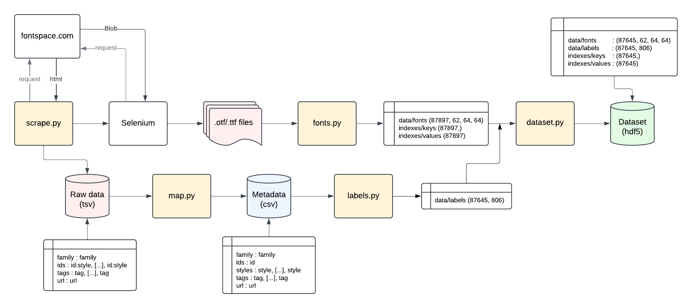

# FontSearch

Thank you for checking out FontSearch! FontSearch is an ongoing personal project with the goal of allowing natural language exploration of typography, inspired by the limited search and filter options available on the Google Fonts platform.

## Dataset

### Web Scraping

Over 65,000 font families were scraped from the free font platform, Font Space. The .otf/.ttf files for each style of each font family was collected, as well as their tagged descriptors (e.g. 'retro', 'invitation', 'handwriting'). Extracting each style yielded a final raw dataset of over 100,000 .otf/.ttf files. The scrape was performed using selenium.

### Font images

Using the .otf/.ttf files for each family and style, 62 characters (A-Z, a-z, 0-9) are represented by (64, 64) arrays, yielding a (62, 64, 64) shape tensor for each .otf/.ttf file. Some files were corrupted or could not be rendered by PILLOW, leaving 87,897 valid font tensors as this stage.

### Metadata and cleaning

The descriptive tags available on Font Space are susceptible to inconsistent shortenings and human error -- as such, tags with the same meaning were streamlined (e.g. 'bd', 'bld', 'bold' -> 'bold') and misspellings were corrected as much as possible. That being said, there still may be imperfections in the dataset. 

Tags with fewer than 50 instances were trimmed. Families with no styles or tags before or after this trim were also left out of the dataset. In doing so, the original size of over 100,000 families and styles is reduced to 87,645 final tagged font tensors.

### Labeling

There are 806 unique labels, which are represented in the dataset using one-hot vectors. This leaves us with a label vector of shape (87645, 806).

### Dataset

The final dataset is stored inside of a .hdf5 file with the following structure:

``` bash
fonts.hdf5
.
├── data
│   ├── <HDF5 dataset "fonts": shape (87645, 62, 64, 64), type "|u1">
│   └── <HDF5 dataset "labels": shape (87645, 806), type "|u1">
└── indexes
    ├── <HDF5 dataset "keys": shape (87645,), type "|S5">
    └── <HDF5 dataset "values": shape (87645,), type "<u4">
```

The "keys" dataset corresponds to the ids found in the metadata.csv and can be used to map to the row index of a given font in the dataset.

### Overview



## Training

FontSearch is now in the training stage!! Stay tuned for updates!
